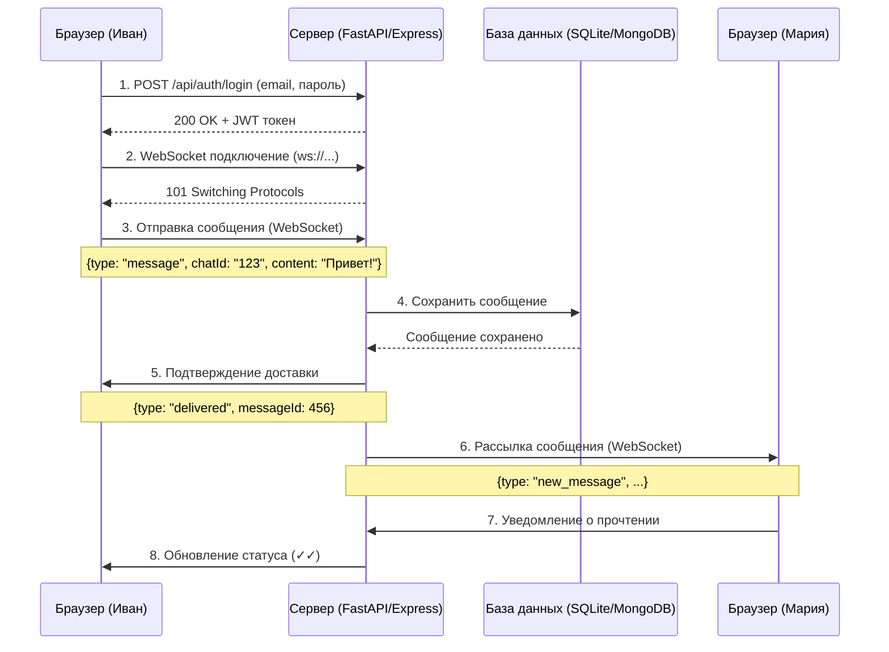
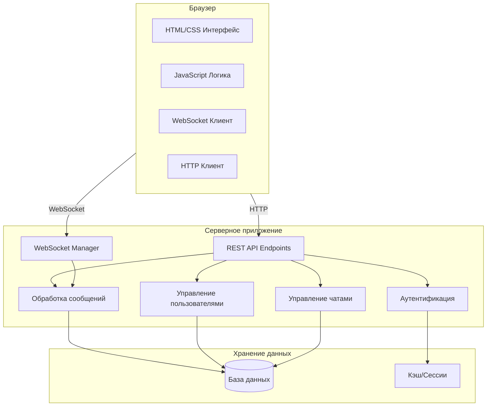

Вот обновленная Архитектурная документация для веб-приложения **QuickChat** с двумя вариантами реализации:

---

# Архитектурная документация (Architectural Documentation)
## Веб-приложение "QuickChat" - Локальный мессенджер для образовательных учреждений

**Версия:** 2.0 (веб-версия)
**Дата:** 19 января 2026
**Автор:** Юхин Лавр Юрьевич / 21ИС-24
**Статус:** Учебный проект (реализован в двух вариантах)

---

## 1. Общая архитектура системы

### 1.1. Высокоуровневая архитектура

Проект QuickChat реализован в **двух вариантах**, что демонстрирует гибкость архитектурных решений и позволяет сравнить различные подходы к построению веб-мессенджеров.

#### Вариант А: Python (FastAPI + SQLite)

```
┌─────────────────────────────────────────────────────────────────┐
│                      Локальная сеть учреждения                   │
├─────────────────────────────────────────────────────────────────┤
│                                                                 │
│  ┌──────────────┐                    ┌──────────────────────┐ │
│  │   Клиент 1   │◄──HTTP/WebSocket───│       Сервер         │ │
│  │   (Браузер)  │                    │    (FastAPI + WS)    │ │
│  └──────────────┘                    │  ┌────────────────┐  │ │
│         │                            │  │   SQLite БД    │  │ │
│  ┌──────────────┐                    │  │  (сообщения,   │  │ │
│  │   Клиент 2   │◄──HTTP/WebSocket───│  │   профили)     │  │ │
│  │   (Браузер)  │                    │  └────────────────┘  │ │
│  └──────────────┘                    └──────────────────────┘ │
│         │                                                    │
│  ┌──────────────┐                                            │
│  │   Клиент N   │◄───────────────────────────────────────────│
│  │   (Браузер)  │                                            │
│  └──────────────┘                                            │
└─────────────────────────────────────────────────────────────────┘
```

#### Вариант Б: Node.js (Express + MongoDB)

```
┌─────────────────────────────────────────────────────────────────┐
│                      Локальная сеть учреждения                   │
├─────────────────────────────────────────────────────────────────┤
│                                                                 │
│  ┌──────────────┐                    ┌──────────────────────┐ │
│  │   Клиент 1   │◄──HTTP/Socket.io───│       Сервер         │ │
│  │   (Браузер)  │                    │   (Express + WS)     │ │
│  └──────────────┘                    │  ┌────────────────┐  │ │
│         │                            │  │    MongoDB     │  │ │
│  ┌──────────────┐                    │  │  (сообщения,   │  │ │
│  │   Клиент 2   │◄──HTTP/Socket.io───│  │   профили)     │  │ │
│  │   (Браузер)  │                    │  └────────────────┘  │ │
│  └──────────────┘                    └──────────────────────┘ │
│         │                                                    │
│  ┌──────────────┐                                            │
│  │   Клиент N   │◄───────────────────────────────────────────│
│  │   (Браузер)  │                                            │
│  └──────────────┘                                            │
└─────────────────────────────────────────────────────────────────┘
```

### 1.2. Ключевые архитектурные решения

| Решение | Обоснование | Альтернативы |
|---------|-------------|--------------|
| **Монолитная архитектура** | Простота разработки и развертывания для учебного проекта | Микросервисы (избыточно) |
| **WebSocket для real-time** | Минимальная задержка, двусторонняя связь | HTTP Long Polling (медленнее) |
| **JWT аутентификация** | Stateless, масштабируемость | Сессии (stateful) |
| **Два варианта реализации** | Сравнительный анализ стеков | Один стек (менее показательно) |

---

## 2. Компонентная архитектура

### 2.1. Клиентская часть (браузер)

```
┌─────────────────────────────────────────────────────────────┐
│                    Клиент (Браузер)                          │
├─────────────────────────────────────────────────────────────┤
│  ┌───────────────────────────────────────────────────────┐  │
│  │              UI Layer (HTML/CSS)                       │  │
│  │  • Страница входа/регистрации                          │  │
│  │  • Главная страница с чатами                           │  │
│  │  • Адаптивный дизайн (мобильные/десктоп)               │  │
│  └───────────────────────────────────────────────────────┘  │
│                            │                                 │
│  ┌───────────────────────────────────────────────────────┐  │
│  │           Business Logic Layer (JavaScript)            │  │
│  │  • Модуль аутентификации (auth.js)                    │  │
│  │  • Модуль сообщений (chat.js)                          │  │
│  │  • Модуль пользователей (users.js)                     │  │
│  │  • Обработка событий WebSocket/Socket.io               │  │
│  └───────────────────────────────────────────────────────┘  │
│                            │                                 │
│  ┌───────────────────────────────────────────────────────┐  │
│  │              Network Layer (JS)                        │  │
│  │  • HTTP клиент (fetch API / axios)                     │  │
│  │  • WebSocket клиент (native / socket.io-client)        │  │
│  │  • Обработка ошибок и переподключение                  │  │
│  └───────────────────────────────────────────────────────┘  │
└─────────────────────────────────────────────────────────────┘
```

### 2.2. Серверная часть — Вариант А (Python/FastAPI)

```
┌─────────────────────────────────────────────────────────────┐
│              Сервер QuickChat (Python/FastAPI)              │
├─────────────────────────────────────────────────────────────┤
│  ┌───────────────────────────────────────────────────────┐  │
│  │              API Layer (FastAPI)                       │  │
│  │  • /api/auth/* - аутентификация и регистрация          │  │
│  │  • /api/users/* - управление пользователями            │  │
│  │  • /api/chats/* - управление чатами                    │  │
│  │  • /api/messages/* - работа с сообщениями              │  │
│  │  • /ws - WebSocket endpoint для real-time              │  │
│  │  • /docs - автоматическая Swagger документация         │  │
│  └───────────────────────────────────────────────────────┘  │
│                            │                                 │
│  ┌───────────────────────────────────────────────────────┐  │
│  │           Business Logic Layer (Python)                │  │
│  │  • AuthService - регистрация, JWT, bcrypt              │  │
│  │  • UserService - профили, статусы, поиск               │  │
│  │  • ChatService - создание чатов, участники             │  │
│  │  • MessageService - сохранение, история, удаление      │  │
│  │  • WebSocketManager - управление соединениями          │  │
│  └───────────────────────────────────────────────────────┘  │
│                            │                                 │
│  ┌───────────────────────────────────────────────────────┐  │
│  │            Data Access Layer (SQLAlchemy)              │  │
│  │  • Модели: User, Chat, Message, ChatParticipant        │  │
│  │  • CRUD операции через ORM                             │  │
│  │  • SQLite (файловая база данных)                       │  │
│  │  • Индексы для оптимизации запросов                    │  │
│  └───────────────────────────────────────────────────────┘  │
└─────────────────────────────────────────────────────────────┘
```

### 2.3. Серверная часть — Вариант Б (Node.js/Express)

```
┌─────────────────────────────────────────────────────────────┐
│              Сервер QuickChat (Node.js/Express)             │
├─────────────────────────────────────────────────────────────┤
│  ┌───────────────────────────────────────────────────────┐  │
│  │              API Layer (Express)                       │  │
│  │  • /api/auth/* - аутентификация и регистрация          │  │
│  │  • /api/users/* - управление пользователями            │  │
│  │  • /api/chats/* - управление чатами                    │  │
│  │  • /api/messages/* - работа с сообщениями              │  │
│  │  • Socket.io - real-time события                       │  │
│  │  • Middleware: CORS, JWT валидация, логирование        │  │
│  └───────────────────────────────────────────────────────┘  │
│                            │                                 │
│  ┌───────────────────────────────────────────────────────┐  │
│  │           Business Logic Layer (Node.js)               │  │
│  │  • Controllers - обработка HTTP запросов               │  │
│  │  • Socket handlers - обработка WebSocket событий       │  │
│  │  • Services - бизнес-логика (auth, messages, chats)    │  │
│  │  • Middleware - JWT проверка, валидация                │  │
│  └───────────────────────────────────────────────────────┘  │
│                            │                                 │
│  ┌───────────────────────────────────────────────────────┐  │
│  │            Data Access Layer (Mongoose)                │  │
│  │  • Схемы: User, Chat, Message, Participant             │  │
│  │  • Валидация данных на уровне схем                     │  │
│  │  • MongoDB (документо-ориентированная БД)              │  │
│  │  • Индексы и агрегации для поиска                      │  │
│  └───────────────────────────────────────────────────────┘  │
└─────────────────────────────────────────────────────────────┘
```

---

## 3. Диаграмма компонентов и взаимодействия

### 3.1. Диаграмма последовательности (отправка сообщения)



### 3.2. Диаграмма компонентов



---

## 4. Детальная архитектура компонентов

### 4.1. Сервис аутентификации (Auth Service)

#### Вариант А (Python/FastAPI):
```python
# Основные эндпоинты
@router.post("/register")
async def register(user_data: UserCreate):
    # Хэширование пароля (bcrypt)
    # Сохранение в БД
    # Генерация JWT токена
    return {"token": jwt_token, "user": user}

@router.post("/login")
async def login(credentials: UserLogin):
    # Проверка пароля
    # Обновление статуса online
    # Генерация нового JWT
    return {"token": jwt_token}
```

#### Вариант Б (Node.js/Express):
```javascript
// Маршруты аутентификации
router.post('/register', async (req, res) => {
    // Хэширование пароля (bcryptjs)
    // Сохранение в MongoDB
    // Генерация JWT
});

router.post('/login', async (req, res) => {
    // Проверка учетных данных
    // Обновление статуса
    // Возврат токена
});
```

**Функциональность:**
- ✅ Регистрация новых пользователей (email + пароль)
- ✅ Вход в систему (JWT токены)
- ✅ Хэширование паролей (bcrypt)
- ✅ Обновление статуса онлайн/офлайн
- ✅ JWT валидация в middleware

### 4.2. Сервис сообщений (Messaging Service)

#### Модель сообщения (общая):
```javascript
{
  id: "uuid",
  chatId: "uuid",
  senderId: "uuid",
  content: "текст сообщения",
  type: "text|image|file",
  fileData: "base64", // для изображений
  readBy: ["user1", "user2"],
  deletedFor: ["user3"],
  replyTo: "messageId",
  createdAt: "2026-01-19T10:30:00Z"
}
```

#### Вариант А (SQLAlchemy):
```python
class Message(Base):
    __tablename__ = 'messages'
    
    id = Column(Integer, primary_key=True)
    chat_id = Column(Integer, ForeignKey('chats.id'))
    sender_id = Column(Integer, ForeignKey('users.id'))
    content = Column(Text)
    message_type = Column(String(20), default='text')
    file_data = Column(Text, nullable=True)  # base64
    created_at = Column(DateTime, default=datetime.utcnow)
```

#### Вариант Б (Mongoose):
```javascript
const messageSchema = new mongoose.Schema({
    chatId: { type: mongoose.Schema.Types.ObjectId, ref: 'Chat' },
    senderId: { type: mongoose.Schema.Types.ObjectId, ref: 'User' },
    content: String,
    messageType: { type: String, enum: ['text', 'image', 'file'], default: 'text' },
    fileData: String,
    readBy: [{ type: mongoose.Schema.Types.ObjectId, ref: 'User' }],
    createdAt: { type: Date, default: Date.now }
});
```

**Функциональность:**
- ✅ Сохранение текстовых сообщений
- ✅ Хранение изображений (base64)
- ✅ Отметки о прочтении
- ✅ История сообщений с пагинацией
- ✅ Удаление сообщений

### 4.3. WebSocket менеджер

#### Вариант А (Python/websockets):
```python
class WebSocketManager:
    def __init__(self):
        self.active_connections = {}  # user_id -> websocket
    
    async def connect(self, websocket, user_id):
        await websocket.accept()
        self.active_connections[user_id] = websocket
    
    async def send_message(self, message, recipient_id):
        if recipient_id in self.active_connections:
            ws = self.active_connections[recipient_id]
            await ws.send(json.dumps(message))
```

#### Вариант Б (Node.js/Socket.io):
```javascript
io.on('connection', (socket) => {
    const userId = socket.handshake.auth.userId;
    
    socket.on('send_message', async (data) => {
        // Сохраняем в БД
        const message = await Message.create(data);
        
        // Отправляем получателю
        io.to(data.recipientId).emit('new_message', message);
    });
    
    socket.on('typing', (data) => {
        socket.to(data.chatId).emit('user_typing', {
            userId: userId,
            isTyping: data.isTyping
        });
    });
});
```

**События WebSocket/Socket.io:**

| Событие (клиент → сервер) | Описание |
|---------------------------|----------|
| `send_message` | Отправка нового сообщения |
| `typing` | Индикатор печатания |
| `read_message` | Отметка о прочтении |
| `delete_message` | Удаление сообщения |

| Событие (сервер → клиент) | Описание |
|---------------------------|----------|
| `new_message` | Новое сообщение |
| `user_typing` | Кто-то печатает |
| `message_read` | Сообщение прочитано |
| `message_deleted` | Сообщение удалено |
| `user_status` | Изменение статуса |

---

## 5. Модель данных

### 5.1. ER-диаграмма (Вариант А — SQLite)

```
┌─────────────────┐      ┌─────────────────┐      ┌─────────────────┐
│     users       │      │     chats       │      │   messages      │
├─────────────────┤      ├─────────────────┤      ├─────────────────┤
│ id (PK)         │──────│ id (PK)         │      │ id (PK)         │
│ username        │      │ name            │──────│ chat_id (FK)    │
│ email           │      │ is_group        │      │ sender_id (FK)  │
│ password_hash   │      │ created_by (FK) │      │ content         │
│ is_online       │      │ created_at      │      │ message_type    │
│ last_seen       │      └─────────────────┘      │ file_data       │
│ is_admin        │                                │ created_at      │
│ created_at      │                                └─────────────────┘
└─────────────────┘
        │
        │ ┌─────────────────────────────────────┐
        └─│   chat_participants                 │
          ├─────────────────────────────────────┤
          │ chat_id (FK)                         │
          │ user_id (FK)                          │
          │ joined_at                             │
          └─────────────────────────────────────┘
```

### 5.2. Схемы MongoDB (Вариант Б)

**User Schema:**
```javascript
const userSchema = {
    username: { type: String, required: true, unique: true },
    email: { type: String, required: true, unique: true },
    passwordHash: { type: String, required: true },
    avatar: { type: String, default: null },
    isOnline: { type: Boolean, default: false },
    lastSeen: { type: Date, default: Date.now },
    isAdmin: { type: Boolean, default: false },
    createdAt: { type: Date, default: Date.now }
};
```

**Chat Schema:**
```javascript
const chatSchema = {
    name: { type: String },
    isGroup: { type: Boolean, default: false },
    participants: [{ type: ObjectId, ref: 'User' }],
    createdBy: { type: ObjectId, ref: 'User' },
    lastMessage: { type: ObjectId, ref: 'Message' },
    createdAt: { type: Date, default: Date.now }
};
```

**Message Schema:**
```javascript
const messageSchema = {
    chatId: { type: ObjectId, ref: 'Chat', required: true, index: true },
    senderId: { type: ObjectId, ref: 'User', required: true },
    content: { type: String },
    messageType: { 
        type: String, 
        enum: ['text', 'image', 'file'], 
        default: 'text' 
    },
    fileData: { type: String }, // base64
    fileName: { type: String },
    fileSize: { type: Number },
    readBy: [{ type: ObjectId, ref: 'User' }],
    deletedFor: [{ type: ObjectId, ref: 'User' }],
    replyTo: { type: ObjectId, ref: 'Message' },
    createdAt: { type: Date, default: Date.now, index: true }
};
```

---

## 6. Сравнение архитектурных решений

| Компонент | Python (FastAPI) | Node.js (Express) |
|-----------|------------------|-------------------|
| **Язык** | Python 3.10+ | JavaScript/Node.js 18+ |
| **Веб-фреймворк** | FastAPI (асинхронный) | Express (синхронный) |
| **Real-time** | WebSockets (websockets) | Socket.io |
| **База данных** | SQLite + SQLAlchemy | MongoDB + Mongoose |
| **Аутентификация** | PyJWT + passlib[bcrypt] | jsonwebtoken + bcryptjs |
| **Валидация** | Pydantic | Joi / express-validator |
| **Документация API** | Swagger (авто) | OpenAPI (ручная) |
| **Сложность** | Низкая | Средняя |
| **Производительность** | Высокая (асинхронная) | Очень высокая (event loop) |
| **Масштабируемость** | Вертикальная | Горизонтальная |

---

## 7. API архитектура

### 7.1. REST API Endpoints (общие)

#### Аутентификация
```
POST   /api/auth/register    # Регистрация нового пользователя
POST   /api/auth/login       # Вход в систему
POST   /api/auth/logout      # Выход (опционально)
GET    /api/auth/me          # Информация о текущем пользователе
```

#### Пользователи
```
GET    /api/users            # Список всех пользователей
GET    /api/users/:id        # Информация о пользователе
PUT    /api/users/:id        # Обновление профиля
GET    /api/users/online      # Только онлайн пользователи
```

#### Чаты
```
GET    /api/chats            # Список чатов пользователя
POST   /api/chats            # Создание нового чата
GET    /api/chats/:id        # Информация о чате
POST   /api/chats/:id/join   # Присоединение к чату
POST   /api/chats/:id/leave  # Выход из чата
```

#### Сообщения
```
GET    /api/chats/:id/messages?limit=50&offset=0  # История сообщений
POST   /api/chats/:id/messages  # Отправка сообщения
DELETE /api/messages/:id        # Удаление сообщения
PUT    /api/messages/:id/read   # Отметка о прочтении
```

### 7.2. WebSocket события

#### Клиент → Сервер
```json
{
  "type": "message",
  "chatId": "123",
  "content": "Привет!",
  "replyTo": null
}

{
  "type": "typing",
  "chatId": "123",
  "isTyping": true
}

{
  "type": "read",
  "messageId": "456"
}

{
  "type": "delete",
  "messageId": "456",
  "forAll": true
}
```

#### Сервер → Клиент
```json
{
  "type": "new_message",
  "message": {
    "id": "789",
    "senderId": "user1",
    "content": "Привет!",
    "timestamp": "2026-01-19T10:30:00Z"
  }
}

{
  "type": "user_status",
  "userId": "user2",
  "isOnline": true
}

{
  "type": "typing",
  "userId": "user3",
  "chatId": "123",
  "isTyping": true
}

{
  "type": "message_read",
  "messageId": "456",
  "userId": "user4"
}
```

---

## 8. Потоки данных (детально)

### 8.1. Поток: Регистрация и вход

```
┌─────────┐         ┌─────────┐         ┌─────────┐         ┌─────────┐
│ Клиент  │         │  API    │         │  Auth   │         │   БД    │
└────┬────┘         └────┬────┘         └────┬────┘         └────┬────┘
     │ POST /register    │                   │                   │
     │───────────────────>                   │                   │
     │                   │                   │                   │
     │                   │ Валидация данных  │                   │
     │                   │──────────────────>│                   │
     │                   │                   │                   │
     │                   │                   │ Хэширование       │
     │                   │                   │ пароля (bcrypt)   │
     │                   │                   │───┐               │
     │                   │                   │   │               │
     │                   │                   │<──┘               │
     │                   │                   │                   │
     │                   │                   │ INSERT INTO users │
     │                   │                   │──────────────────>│
     │                   │                   │                   │
     │                   │                   │        OK         │
     │                   │                   │<──────────────────│
     │                   │                   │                   │
     │                   │ Генерация JWT     │                   │
     │                   │──────────────────>│                   │
     │                   │                   │                   │
     │ 201 Created + JWT │                   │                   │
     │<───────────────────                   │                   │
┌────┴────┐         ┌────┴────┐         ┌────┴────┐         ┌────┴────┐
│ Клиент  │         │  API    │         │  Auth   │         │   БД    │
└─────────┘         └─────────┘         └─────────┘         └─────────┘
```

### 8.2. Поток: Отправка сообщения в групповой чат

```
┌─────────┐         ┌─────────┐         ┌─────────┐         ┌─────────┐
│ Иван    │         │ Сервер  │         │   БД    │         │ Мария   │
└────┬────┘         └────┬────┘         └────┬────┘         └────┬────┘
     │                   │                   │                   │
     │ WebSocket:        │                   │                   │
     │ {type: "message"} │                   │                   │
     │───────────────────>                   │                   │
     │                   │                   │                   │
     │                   │ Сохранить в БД    │                   │
     │                   │──────────────────>│                   │
     │                   │                   │                   │
     │                   │        OK         │                   │
     │                   │<──────────────────│                   │
     │                   │                   │                   │
     │ WebSocket:        │                   │                   │
     │ {type: "delivered"}│                   │                   │
     │<───────────────────                   │                   │
     │                   │                   │                   │
     │                   │ WebSocket: new_message                │
     │                   │──────────────────────────────────────>│
     │                   │                   │                   │
     │                   │                   │      WebSocket:   │
     │                   │                   │      {type: "read"}│
     │                   │<──────────────────────────────────────│
     │                   │                   │                   │
     │ WebSocket:        │                   │                   │
     │ {type: "read"}    │                   │                   │
     │<───────────────────                   │                   │
┌────┴────┐         ┌────┴────┐         ┌────┴────┐         ┌────┴────┐
│ Иван    │         │ Сервер  │         │   БД    │         │ Мария   │
└─────────┘         └─────────┘         └─────────┘         └─────────┘
```

---

## 9. Требования к развертыванию

### 9.1. Минимальные требования (Вариант А — Python)

| Компонент | Требование |
|-----------|------------|
| **ОС** | Windows 10/11, Linux (Ubuntu 20.04+), macOS |
| **Python** | 3.8 или выше |
| **RAM** | 512 МБ |
| **Диск** | 100 МБ свободного места |
| **Сеть** | Любая, поддерживающая TCP/IP |

### 9.2. Минимальные требования (Вариант Б — Node.js)

| Компонент | Требование |
|-----------|------------|
| **ОС** | Windows 10/11, Linux (Ubuntu 20.04+), macOS |
| **Node.js** | 16.x или выше |
| **MongoDB** | 5.0 или выше (или Docker) |
| **RAM** | 1 ГБ |
| **Диск** | 500 МБ свободного места |
| **Сеть** | Любая, поддерживающая TCP/IP |

---

## 10. Ограничения архитектуры

### 10.1. Текущие ограничения

1. **Монолитная архитектура** — все функции в одном сервисе
2. **Отсутствие кластеризации** — один сервер обрабатывает всех клиентов
3. **Нет репликации БД** — единая точка отказа
4. **WebSocket без шифрования** — для локальной сети допустимо
5. **Нет кэширования** — все запросы напрямую к БД

### 10.2. Планируемые улучшения

| Компонент | План развития |
|-----------|---------------|
| **База данных** | Добавить Redis для кэширования |
| **Масштабирование** | Горизонтальное масштабирование через балансировщик |
| **Безопасность** | HTTPS, WSS, rate limiting |
| **Мониторинг** | Prometheus + Grafana |
| **CI/CD** | Автоматическое тестирование и деплой |

---

## 11. Заключение

Разработанная архитектура веб-мессенджера QuickChat в двух вариантах (Python/FastAPI и Node.js/Express) обеспечивает:

✅ **Функциональность** — все базовые возможности мессенджера
✅ **Производительность** — реальное время, WebSocket/Socket.io
✅ **Надежность** — обработка ошибок, переподключение
✅ **Масштабируемость** — возможность горизонтального роста
✅ **Простоту развертывания** — одна команда для запуска
✅ **Учебную ценность** — сравнение двух популярных стеков

Выбор конкретного варианта зависит от предпочтений разработчика и требований к проекту:
- **Python/FastAPI** — для быстрого старта и простоты
- **Node.js/Express** — для максимальной производительности и масштабируемости

---

**Разработал:**
___________________________
Юхин Лавр Юрьевич
Студент группы 21ИС-24
Дата: 19.01.2026

---

*Версия документа: 2.0*
*Статус: Актуально*
